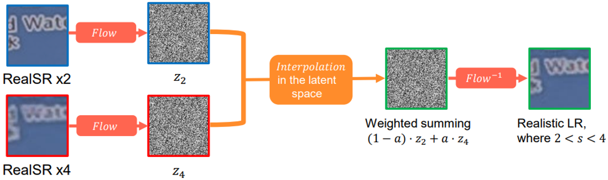

# Learning Controllable Degradation <br>for Real-World Super-Resolution via Constrained Flows
Seobin Park*, Dongjin Kim*, Sungyong Baik, and Tae Hyun Kim
<br>\*Equal Contribution

[[ICML2023] Paper](https://openreview.net/forum?id=M3IX2zAIdi)

> Recent deep-learning-based super-resolution (SR) methods have been successful in recovering high-resolution (HR) images from their low-resolution (LR) counterparts, albeit on the synthetic and simple degradation setting: bicubic downscaling. 
On the other hand, super-resolution on real-world images demands the capability to handle complex downscaling mechanism which produces different artifacts (e.g., noise, blur, color distortion) upon downscaling factors.
To account for complex downscaling mechanism in real-world LR images, there have been a few efforts in constructing datasets consisting of LR images with real-world downsampling degradation.
However, making such datasets entails a tremendous amount of time and effort, thereby resorting to very few number of downscaling factors (e.g., $\times2, \times3, \times4$).
To remedy the issue, we propose to generate realistic SR datasets for unseen degradation levels by exploring the latent space of real LR images and thereby producing more diverse yet realistic LR images with complex real-world artifacts.
Our quantitative and qualitative experiments demonstrate the accuracy of the generated LR images,
and we show that the various conventional SR networks trained with our newly generated SR datasets can produce much better HR images.

## Table of Contents

- [Framework Overview](#framework-overview)
- [How to run](#how-to-run)
  - [Installation](#installation)
  - [Training and Evaluation](#training-and-evaluation)
- [Results](#results)
- [Citation](#citation)
- [Acknowledgement](#acknowledgement)


## Framework Overview

### Training
<p align="center">
  
</p>

### Inference
<p align="center">
  
</p>

## How to run

### Installation

```bash
# Clone this repo
git clone https://github.com/dongjinkim9/InterFlow.git
cd InterFlow

# Create and activate conda environment
conda env create -f environments.yaml
conda activate interflow
```


### Training and Evaluation

<table>
  <tr>
    <th align="left">Model</th>
    <th align="center">Training Instructions</th>
    <th align="center">Testing Instructions</th>
  </tr>
  <tr>
    <td align="left">InterFlow</td>
    <td align="center"><a href="interflow/README.md#Training">Link</a></td>
    <td align="center"><a href="interflow/README.md#Generation">Link</a></td>
  </tr>
  <tr>
    <td align="left">SR Networks</td>
    <td align="center"><a href="sr_networks/README.md#training">Link</a></td>
    <td align="center"><a href="sr_networks/README.md#evaluation">Link</a></td>
  </tr>
</table>

## Results

### InterFlow
| GT    | RealSR $\times2$ | RealSR $\times4$ | InterFlow ($\times2$ ~ $\times4$)|
| :---: | :---:         | :---:            | :---:            |
|  |  |  |  |
|  |  |  |  |

### SR networks with InterFlow 


## Citation

If you find our work useful in your research, please consider citing our paper:

```bibtex
@article{park2023learning,
  title={Learning Controllable Degradation for Real-World Super-Resolution via Constrained Flows},
  author={Park, Seobin and Kim, Dongjin and Baik, Sungyong and Kim, Tae Hyun},
  journal={ICML},
  year={2023}
}
```

## Acknowledgement

The codes are based on [DeFlow](https://github.com/volflow/DeFlow). We thank the authors for sharing their codes.
